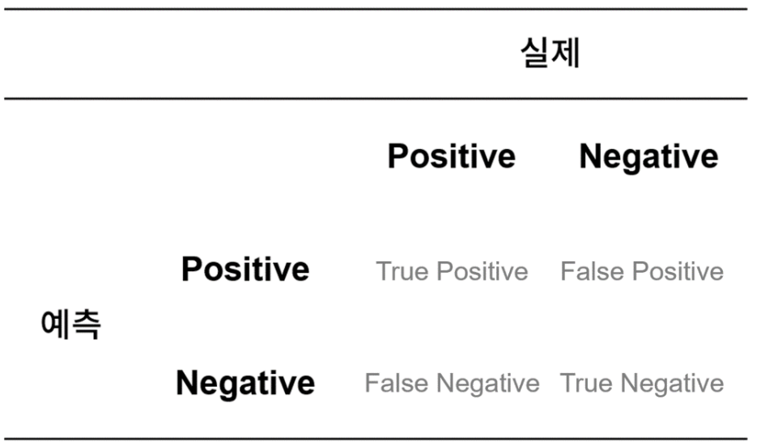

# 머신러닝을 위한 기초통계

### 자유도

#### : 독립변수의 개수 혹은 통계적 제한을 받지 않고 자유롭게 정할 수 있는 원소의 수

##### Ex) x + y + z = 10 일 때, x와 y는 자유도가 있지만, 두 변수가 결정되는 순간 z는 종속변수로 고정, 따라서 z는 자유도가 없게 됨.

##### 총 변수 n 일 때 자유도는 n-1이라고 말할 수 있음.

### 공분산, 상관계수, 다중공산성

#### 공분산: 두 변수가 함께 변화하는 정도를 나타내는 지표

#### 상관계수: 공분산의 단위적인 한계를 보완하기 위해 표준화한 수치

#### 다중공선성: 두 변수 혹은 변인의 관련성이 높은 상태.

##### 다중공선성의 문제: 회귀분석의 전제가정인 독립변수들 간의 상관관계가 높으면 안된다는 조건을 위배하고 차원을 높여 모델활용의 효율성을 낮춤

##### 따라서 모델 선정 전에 상관관계 확인 필수!

### 

### 분류 모델 성능 평가지표 - Confusion Matrix

#### 정확도(Accuracy)

- 전체 영역중 실제값과 예측값이 동일한 경우의 비율

#### 정밀도(Precision)

- 예측값인 Positive인 경우들 중에서 실제값 또한 Positive인 경우의 비율

#### 재현도(Recall)

- 실제값인 Positive인 경우들 중, 예측값 또한 Positive인 경우의 비율

#### F1 Score

