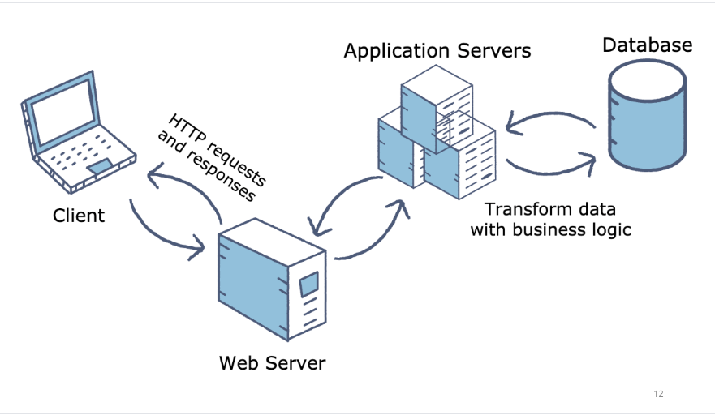

# 데이터베이스&SQL

## 데이터베이스(DB)

### 여러 사람에 의해 공유되어 사용할 목적으로 통합하여 관리되는 데이터의 집합, DB

### 관계형 데이터베이스(RDBMS)

#### 데이터를 로우(행), 컬럼(열)과 같이 일종의 표 형태로 저장하고 종속성을 관계(Relation)으로 표현함

##### 컬럼의 구조와 데이터의 관계가 테이블 스키마(Schema)로 사전 정의되고, SQL(구조화 질의 언어)에 의해서 정교한 검색 쿼리를 제공하며 상상하는 거의 모든 방식으로 데이터를 다룰 수 있게 함

## SQL

### 2차원의 정형데이터를 다루는 가장 효율적인 언어

- Data의 처리 과정을 기술하는 방법이 아닌 원하는 Data의 요건을 기술하는 방식[SQL = Data 요건정의서] (단순성, 높은 생산성)
- Data의 요건이 기술된 요건 정의서 형태이므로 요건의 변경시 적은 수정으로 요건을 반영할 수 있음(효율적인 유지보수)

1. DDL(Data Definition Language : 데이터 정의 언어)
   - create
   - drop
   - alter
2. DML(Data Manipulation Language : 데이터 조작 언어)
   - insert
   - update
   - delete
   - select
3. DCL(Data Control Language : 데이터 제어 언어)
   - grant
   - revoke

### 기초 문법(SELECT - FROM)

- SELECT : 선택하고자 하는 속성목록을 기술

- FROM : Source Data Set을 기술

- WHERE[optional] : 선택하고자 하는 행의 조건의 목록을 기술

- GROUP BY[optional] : 집계하고자 하는 기준속성목록을 기술

- HAVING[optional] : 집계된 행을 기준으로 선택하고자 하는 행의 조건목록을 기술함.(Group by 선행)

- ORDER BY[optional] : 정렬의 기준이 되는 속성목록과 각 속성 목록의 정렬방식(오름, 내림)을 기술

  

