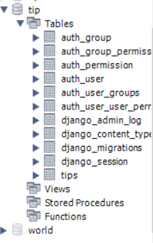

# Django web programming


## 1. 장고 설치 및 환경 구축하기

- conda install django
- pip install django


## 2. Django Project 시작하기

- django-admin startproject [project name]


- 장고 프로젝트 생성시 프로젝트 명과 함께 프로젝트 기본 파일이 생성됨.


- `manage.py`: Django 프로젝트와 다양한 방법으로 상호작용 하는 커맨드라인의 유틸리티
- `mysite/` 디렉토리 내부에는 프로젝트를 위한 실제 Python 패키지들이 저장됨. 이 디렉토리 내의 이름을 이용하여, (`mysite.urls` 와 같은 식으로) 프로젝트의 어디서나 Python 패키지들을 임포트할 수 있음.
- `mysite/__init__.py`: Python으로 하여금 이 디렉토리를 패키지처럼 다루라고 알려주는 용도의 단순한 빈 파일
- `mysite/settings.py`: 현재 Django 프로젝트의 환경 및 구성을 저장. [Django settings](https://docs.djangoproject.com/ko/3.2/topics/settings/)에서 환경 설정이 어떻게 동작하는지 확인 가능
- `mysite/urls.py`: 현재 Django project 의 URL 선언을 저장. 
- `mysite/asgi.py`: An entry-point for ASGI-compatible web servers to serve your project. 
- `mysite/wsgi.py`: 현재 프로젝트를 서비스하기 위한 WSGI 호환 웹 서버의 진입점

### 3. 서버 실행하기

- python manage.py runserver


- 아래 그림의 http://127.0.0.1:8000/ 이 생성된 개발서버의 주소가 됨


## 4. 앱 만들기

- python manage.py startapp polls(polls 디렉토리 생성)


## 5. 첫 번째 뷰 작성하기

- polls/view.py를 열어 다음 코드를 입력

```python
#polls/view.py

from django.http import HttpResponse

def index(request):
	return HttpResponse("Hello, world. You're at the polls index.")
```


- 뷰를 호출하기 위해선 이와 연결된 url이 필요 > urls.py 파일 생성

```python
#polls/urls.py

from django.urls import path

from . import views

urlpatterns = [
    path('', views.index, name='index'),
]

```


- 최상위 URLconf에서 polls.urls 모듈을 바라보게 설정, urlpatterns 리스트에 include() 함수 설정
  - 다른 url 패턴을 포함할 때마다 항상 include()를 사용해야 함

```python
from django.contrib import admin
from django.urls import include, path

urlpatterns = [
    path('polls/', include('polls.urls')),
    path('admin/', admin.site.urls),
]
```


## 6. DB 세팅

- DB 연결 최상위 섹션에서 setting.py에 다음 코드를 입력

```python
# mysite/setting.py

DATABASES = {
    'default': {
        'ENGINE': 'django.db.backends.postgresql',
        'NAME': 'db명',
        'USER': '유저이름',
        'PASSWORD': '비밀번호',
        'HOST': '127.0.0.1',
        'PORT': '5432',
    }
}
```

- 결과 화면 mySQL workbench에서 db 연결 결과를 확인할 수 있음



## 7. 관리자 생성하기

- 관리 사이트에 로그인 할 수 있는 사용자 만들기

  1. ```python
     python manage.py createsuperuser
     ```

  2. ```python
     Username: admin
     ```

  3. ```python
     Email address: admin@example.com
     ```

  4. ```python
     Password: **********
     Password (again): *********
     Superuser created successfully.
     ```

     

## 8. 개발 서버 시작

- 다음 코드를 통해 시작

```python
python manage.py runserver
```

- 서버 주소 끝에 /admin/ 입력시 다음과 같은 화면 호출


- 생성한 유저 이름과 패스워드를 입력하면 끝

