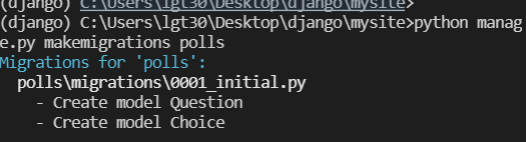
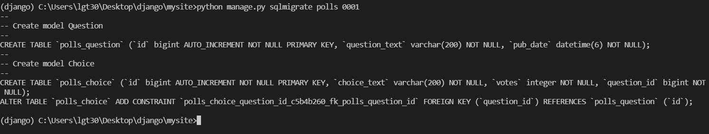
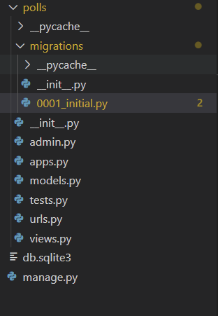
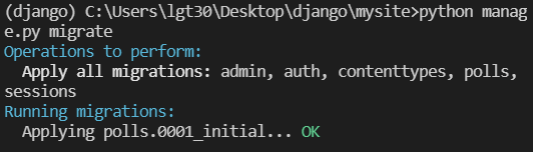
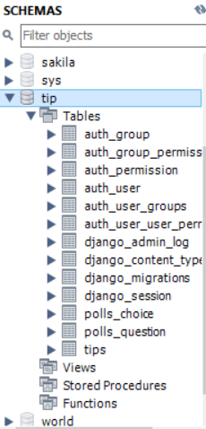
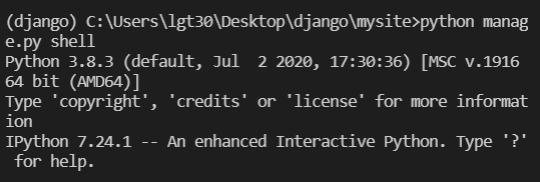
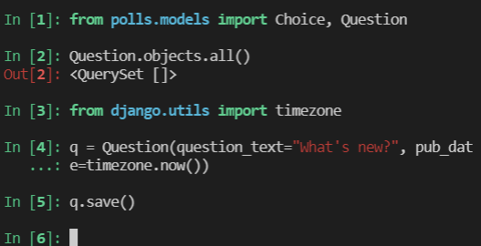
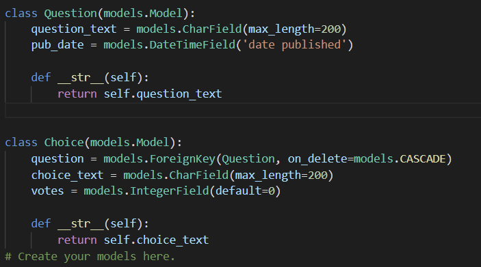

# Django migration & API

## 데이터 마이그레이션(Data migration)

### 정의 :

데이터를 한 위치에서 다른 위치로, 한 형식에서 다른 형식으로 또는 한 애플리케이션에서 다른 애플리케이션으로 이동하는 프로세스를 의미함.


### 프로세스:

1. makemigtration - 디렉토리에 migration을 위한 디렉토리를 생성함




```django
python manage.py makemigrations polls
```

- migration 리스트 확인





- 생성결과




2. migrate 실행




```
python manage.py migrate
```



- 실행결과 - mySQL workbench 내에서 polls_choice, polls_question 테이블 생성 결과 확인


## API

### 정의 :  애플리케이션 소프트웨어를 구축하고 통합하기 위한 정의 및 포로토콜 세트로, 애플리케이션 프로그래밍 인터페이스를 나타냄


#### 사전 준비 : django 내 shell 연결




1. 투표 어플리케이션 제작  - Question 지정 및 db저장



2. str 메소드 설정 - str 메소드를 설정하지 않으면 Question text를 확인하기 어려움



